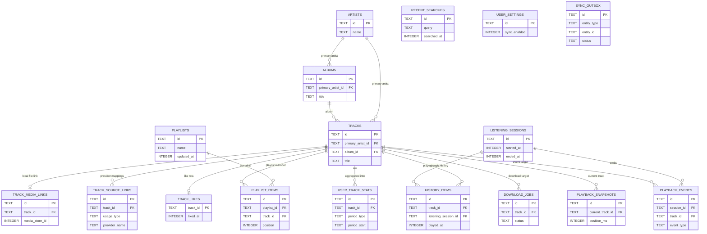

# Room Relationships

## Objectif
Donner une vue relationnelle des tables `Room` sans recopier l'integralite du schema colonne par colonne.

## Principes de lecture
- Ce diagramme ne couvre que les relations structurelles de `Room`.
- Les resultats online transitoires n'entrent pas en base tant qu'aucune action metier significative n'a eu lieu.
- La `priority queue` n'apparait pas ici car elle n'est pas persistee.

## Cardinalites importantes
- `track_media_links` impose une relation 1 piste AURA <-> 1 entree `MediaStore` dans le schema actuel.
- `track_source_links` autorise plusieurs mappings par piste, differencies par `usage_type`.
- `playlist_items` porte l'ordre reel de lecture dans une playlist et autorise plusieurs occurrences d'une meme piste.
- `playback_snapshots` ne contient qu'une seule ligne active au niveau applicatif, meme si la relation vers `tracks` reste structurellement optionnelle.
- `recent_searches`, `user_settings` et `sync_outbox` sont volontairement faiblement relies au reste du graphe.

## Regles de presence en base
- Une piste online entre dans `Room` quand elle devient utile a l'etat metier : lecture, like, ajout a playlist, cache detaille ou preparation de telechargement.
- Une piste online issue d'une simple recherche non actionnee reste ephemere et ne cree pas d'ecriture `Room`.
