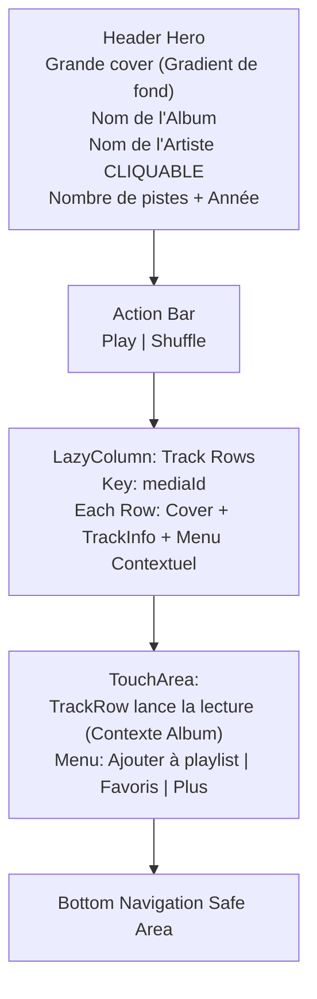

# Album Screen Layout

## Objectif
Définir l'architecture visuelle de l'écran Album (`AlbumScreen`), en s'assurant du respect strict des tokens DA (DarkTheme, typography Outfit, formes arrondies) et de l'intégration avec le reste du projet. L'écran liste toutes les pistes appartenant à un même album et en offre le point d'entrée pour la lecture canonique (contexte d'album).

## AlbumScreen - Schéma Vertical



## AlbumScreen - Coupe Mobile (État par défaut)

```text
+--------------------------------------------------+
| [Retour Flèche]                                  |
|                                                  |
|              [ Grande Cover ]                    |
|              [    Carrée    ]                    |
|                                                  |
|              Discovery (LP)                      |
|              Daft Punk (cliquable)               |
|              14 pistes • 2001                    |
|                                                  |
|  [ (>) Play ]    [ (x) Shuffle ]                |
|                                                  |
| +----------------------------------------------+ |
| | [Cover] One More Time              4:27 (⋮) | |
| +----------------------------------------------+ |
|                                                  |
| +----------------------------------------------+ |
| | [Cover] Aerodynamic                3:32 (⋮) | |
| +----------------------------------------------+ |
|                                                  |
| +----------------------------------------------+ |
| | [Cover] Digital Love               5:01 (⋮) | |
| +----------------------------------------------+ |
|                                                  |
|               [Mini-Player Floating]             |
|                                                  |
+--------------------------------------------------+
|   Home   |   Search   | (o) Library | Settings   |
+--------------------------------------------------+
```

## Composants & États

### Header Hero
- Grande jaquette de l'album avec gradient de secours
- Centré avec paddings

### Album Info
- **Titre** : Nom de l'album (bold, headlineMedium)
- **Artiste** : Cliquable (bleu/primary) → navigue vers ArtistScreen
- **Métadonnées** : Nombre de pistes + année de sortie

### Action Bar
- **Play** : Lance la lecture depuis la première piste (contexte album)
- **Shuffle** : Lance la lecture mélangée

### TrackRow avec Menu Contextuel
- Affiche la cover de chaque piste
- Clique simple : Lance la piste (contexte album)
- Menu ⋮ (DropdownMenu) :
  - "Ajouter à une playlist"
  - "Ajouter aux favoris"
  - "Plus" (extensible)

## Navigation
- Retour : Rétro-navigation vers l'appelant (Library, Search, etc.)
- Clic sur nom d'artiste : Navigue vers ArtistScreen
- Clic sur une piste : Déclenche le player avec le plein contexte de l'album (`startIndex` = index de la piste cliquée)
- Menu ⋮ : Actions contextuelles sur chaque piste
