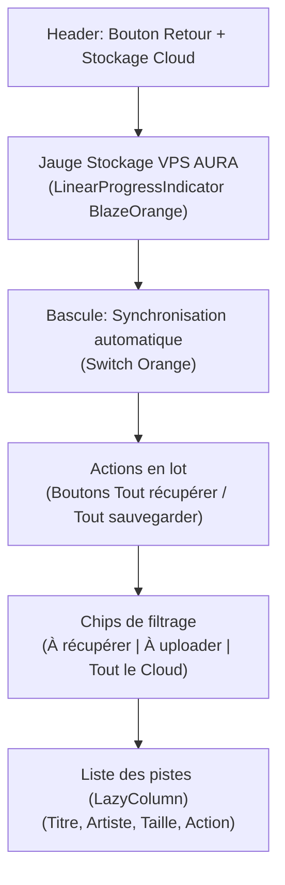

# Cloud Sync Screen Layout (Android)

## Objectif
Définir l'architecture visuelle et le zoning de l'écran de synchronisation cloud (`CloudSyncScreen`) sur mobile.

## Schéma Vertical



## Zoning Mobile Approximatif

```text
+--------------------------------------------------+
| <-  Stockage Cloud                               |
|                                                  |
| Espace utilisé VPS AURA                          |
| [====================--------] 42% (2.10 Go / 5G)|
|                                                  |
| Synchronisation automatique                 (o)  |
|                                                  |
| Actions globales                                 |
| [ TOUT RÉCUPÉRER ]      [ TOUT SAUVEGARDER ]     |
|                                                  |
| [ À récupérer ]  [ À uploader ]  [ Tout le Cloud]|
|                                                  |
| Pistes                                           |
| [Cover] Get Lucky                                |
| Daft Punk - 8.4 Mo               [ Télécharger ] |
|                                                  |
| [Cover] Time                                     |
| Pink Floyd - 9.1 Mo                  [ Envoyer ] |
|                                                  |
| [Cover] Hysteria                                 |
| Muse - 7.5 Mo                      [ Supprimer ] |
|                                                  |
|                                                  |
|               [Mini-Player Floating]             |
+--------------------------------------------------+
```

## Jetpack Compose Mapping (Tokens)
- **Background Général** : `DeepBlack` (`#050505`).
- **Cartes & Conteneurs** : `DarkGraphite` (`#1E1E1E`) avec un arrondi de `16.dp` pour la jauge de stockage et les boutons d'action.
- **Jauge de stockage** : `LinearProgressIndicator` avec couleur active `BlazeOrange` et couleur de piste `DarkGraphite` en sourdine.
- **Bouton d'action contextuel** :
  - Si l'action est requise (Télécharger / Envoyer) : Bouton stylisé avec un fond orange en sourdine ou texte coloré.
  - Si l'action est destructive (Supprimer) : Icône `Delete` avec couleur neutre ou rouge.
- **Commutateur** : `Switch` avec `checkedTrackColor = BlazeOrange` et `checkedThumbColor = Color.White`.
