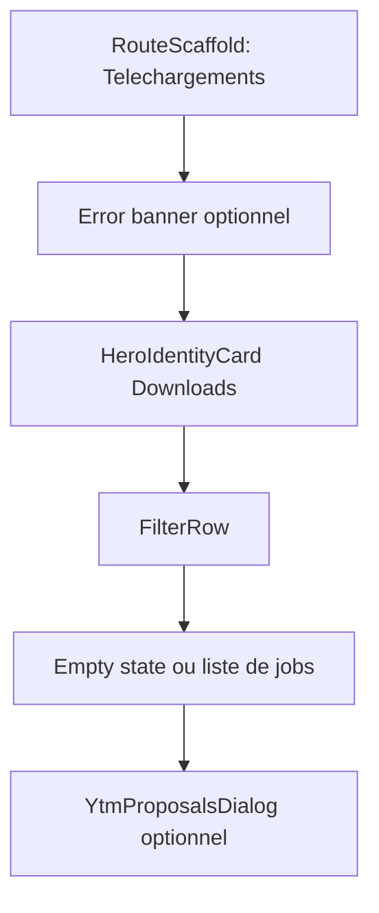

# Downloads Screen Layout

## Objectif
Definir le layout canonique de l'ecran `Downloads`, qui suit les jobs de disponibilite hors-ligne, expose les actions de reprise et permet la lecture directe d'un fichier rapatrie dans le stockage prive de l'application.

## Structure racine
- `RouteScaffold`
- titre : `Telechargements`
- bouton TopBar `Refresh` pour `forceRefresh()`
- contenu vertical :
  - bandeau d'erreur non bloquant si `errorMessage != null`
  - `LazyColumn` principale
  - dialogue de resolution YouTube Music si un job demande un choix utilisateur

## Ordre vertical


## Header hero
- composant : `HeroIdentityCard`
- titre : `Downloads`
- sous-texte : gestion et lecture des pistes hors-ligne en temps reel
- degrade : orange AURA vers noir profond

## Filtres
- composant : `FilterRow`
- onglets visibles :
  - `En cours (N)`
  - `Termines (N)`
  - `Erreurs (N)`
- `En cours` regroupe les statuts `queued`, `requires_resolution` et `running`
- `Termines` regroupe `succeeded`
- `Erreurs` regroupe `failed` et `cancelled`
- l'onglet selectionne est stocke dans `DownloadsUiState.selectedTab`

## Bandeau d'erreur
- visible quand `DownloadsUiState.errorMessage` est non nul
- carte pleine largeur avec fond rouge sombre
- titre : `Erreur de synchronisation`
- message : texte d'erreur courant
- bouton `Close` pour `dismissError()`
- l'erreur ne masque pas les jobs deja connus localement

## Empty states
- composant : `DownloadStateCard`
- chaque filtre possede son message dedie :
  - `En cours` : aucune progression active
  - `Termines` : aucun download finalise
  - `Erreurs` : pas d'erreur de job
- l'ancien libelle `En attente` reste un fallback de compatibilite, mais l'UI courante expose `En cours`

## DownloadJobRow

### Conteneur
- `Card` pleine largeur
- padding horizontal 16.dp
- fond de ligne `#1E1E1E`
- coins 12.dp
- layout en `Row`

### Visuel
- cover 44.dp si `coverUri` existe
- placeholder AURA sinon
- coins 6.dp

### Informations
- titre en `titleSmall`, semi-bold, une ligne
- artiste en `bodySmall`, une ligne
- etat affiche sous l'artiste selon `job.status`

### Etats de ligne
- `running`
  - `LinearProgressIndicator`
  - progression `progressPercent / 100`
  - pourcentage affiche a droite
- `queued`
  - texte : `Dans la file d'attente...`
- `requires_resolution`
  - texte accent orange : `Choix de version requis`
  - action `Choisir`
- `failed`
  - texte rouge : `Erreur : ...`
  - action `Reessayer`
- `cancelled`
  - action `Reessayer`
- `succeeded`
  - texte vert : `Telecharge avec succes`
  - action `Lire`

### Actions trailing
- `failed` et `cancelled` : bouton `Refresh`, appelle `retryDownload(jobId)`
- `requires_resolution` : bouton compact `Choisir`, charge les candidats puis ouvre le dialogue
- `succeeded` : bouton `PlayArrow`, lance le player avec le contexte `downloads`
- `queued` et `running` : pas d'action trailing dans l'UI courante

## Lecture d'un download termine
- le fichier physique attendu est `context.filesDir/downloads/{trackId}.mp3`
- l'UI verifie l'existence du fichier et sa taille avant de construire le `contentUri`
- la piste est convertie en `TrackListRow` minimal puis jouee avec :
  - `contextType = "downloads"`
  - `contextId = "downloads"`
  - `contextTracks = listOf(trackRow.toQueuedTrack())`
  - `startIndex = 0`

## YtmProposalsDialog
- utilise quand le backend retourne un job `requires_resolution`
- hauteur maximale : 80% de l'ecran
- etats internes :
  - chargement des candidats
  - aucun candidat
  - liste de candidats
- chaque candidat affiche :
  - miniature ou placeholder
  - titre
  - artiste et album si disponible
  - duree si disponible
- cliquer un candidat appelle `resolveJob(jobId, videoId)` puis ferme le dialogue
- bouton secondaire : `Annuler`

## StateFlow
```kotlin
data class DownloadsUiState(
    val selectedTab: String = "En cours",
    val jobs: List<DownloadJobRowModel> = emptyList(),
    val queuedCount: Int = 0,
    val runningCount: Int = 0,
    val succeededCount: Int = 0,
    val failedCount: Int = 0,
    val isSyncing: Boolean = false,
    val errorMessage: String? = null
)
```

## Regles fonctionnelles
- l'ecran synchronise les jobs actifs au demarrage
- le polling backend demarre quand le ViewModel est actif
- le polling est arrete dans `onCleared()`
- la liste observe `Room` via `getAllJobsWithTrack()`
- les erreurs reseau restent non bloquantes
- les jobs termines doivent rester lisibles meme si le rafraichissement backend echoue
