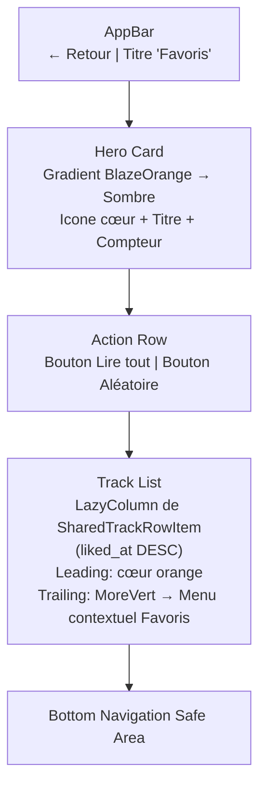

# Favorites Screen Layout

## Objectif
Définir l'architecture visuelle de l'écran Favoris (`FavoritesScreen`), accessible depuis la grille de la Bibliothèque via la tuile **Favoris**. L'écran centralise toutes les pistes que l'utilisateur a likées depuis le player, triées par date de like décroissante.

## Schéma Vertical



## Coupe Mobile Approximative

```text
+--------------------------------------------------+
| ← Favoris                                        |
|                                                  |
| +------------------------------------------------+|
| | ♥                                              ||
| | Favoris                                        ||
| | 12 piste(s) aimée(s)                           ||
| +------------------------------------------------+|
|                                                  |
| [ Lire tout ]  [ Aléatoire ]                     |
|                                                  |
| [cover] Hysteria            Muse | Absolution   ⋮ |
| [cover] Plug In Baby        Muse | Origin of..  ⋮ |
| [cover] Madness             Muse | The 2nd Law  ⋮ |
| [cover] Starlight           Muse | Black Holes  ⋮ |
|   ...                                            |
|                                                  |
|               [Mini-Player Floating]             |
+--------------------------------------------------+
|   Home   |   Search   | (o) Library | Settings   |
+--------------------------------------------------+
```

## Cas : liste vide

Si aucune piste n'est likée, l'écran affiche une `EmptyStateSurface` invitant l'utilisateur à ajouter des favoris depuis le player.

```text
+--------------------------------------------------+
| ← Favoris                                        |
|                                                  |
| +------------------------------------------------+|
| | Aucun favori                                   ||
| | Appuie sur le cœur à coté de tes pistes        ||
| | pour les ajouter ici.                          ||
| +------------------------------------------------+|
+--------------------------------------------------+
```

## Menu Contextuel (TrackRow — Contexte Favoris)

Défini dans `docs/android/ui/component-states.md` — **Contexte Favoris**.
Le `MoreVert` (⋮) ouvre un `DropdownMenu` avec les actions suivantes :

| Action | Condition |
|---|---|
| Lire maintenant | toujours |
| Ajouter à la file d'attente | toujours |
| Ajouter à une playlist | toujours |
| Voir l'artiste | si `artistId != null` |
| Voir l'album | si `albumId != null` |
| **Retirer des favoris (unlike)** | toujours — action unique à ce contexte |
| Télécharger | si non téléchargé localement |
| Supprimer le téléchargement | si téléchargé localement |

> [!NOTE]
> Le menu contextuel n'est pas encore implémenté (placeholder `MoreVert` désactivé). Il sera traité dans le sprint dédié aux menus contextuels TrackRow.


## Données

- Source Room : jointure `tracks INNER JOIN track_likes`, triée par `track_likes.liked_at DESC`.
- La `TrackListRow` expose `isLiked = true` pour toutes les lignes de cet écran.
- L'écran ne trie pas côté Kotlin — le ordre SQL est la source de vérité.

## Contexte de lecture

- `contextType = "favorites"`, `contextId = "favorites"`.
- La totalité de la liste constitue la queue au moment de la lecture.
- Les boutons **Lire tout** et **Aléatoire** construisent la queue complète (ordonnée ou mélangée).

## Jetpack Compose Mapping (Tokens)

- **Background** : `DeepBlack`
- **Hero Card** : gradient `Color(0xFFFF6B00) → Color(0xFF1A0A00)`, arrondi `24.dp`, icône blanche
- **TrackRow** : `SharedTrackRowItem` (composant partagé `ScreenSharedComponents.kt`)
  - Leading : `Icons.Rounded.PlayArrow`, tint `TextSecondary`
  - Trailing : `Icons.Rounded.MoreVert` → menu contextuel Favoris
  - Card arrondie `12.dp`, fond `#1E1E1E`
- **Boutons action** : `Button` Material3 standard, espacement `8.dp`
- **Espacements** : padding horizontal `16.dp`, `contentPadding` vertical `8.dp`
- **État vide** : `EmptyStateSurface` (composant partagé de `ScreenSharedComponents.kt`)
