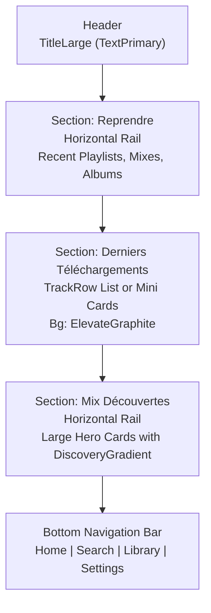

# Home Screen Layout

## Objectif
Définir l'architecture visuelle et le zoning de l'écran d'accueil (`Home`), mis à jour avec les sections demandées (Reprendre, Téléchargements, Découvertes).

## Schéma Vertical



## Coupe Mobile Approximative

```text
+--------------------------------------------------+
| Accueil                                          |
|                                                  |
| Reprendre                                        |
| +--------------+ +--------------+                |
| | Chill Nuit   | | The Dark Side|                |
| | Playlist     | | Album        |                |
| | [Cover]      | | [Cover]      |                |
| +--------------+ +--------------+                |
|                                                  |
| Derniers téléchargements                         |
| [Cover] Time - Pink Floyd         (DarkGraphite) |
| [Cover] Hysteria - Muse                          |
| [Cover] Get Lucky - Daft Punk                    |
|                                                  |
| Mix Découvertes                                  |
| +----------------------------------------------+ |
| | (DiscoveryGradient)                          | |
| | AURA Mix                                     | |
| | Basé sur vos écoutes de Rock                 | |
| |                                              | |
| | [ JOUER LE MIX (TextOnAccent) ]              | |
| +----------------------------------------------+ |
|                                                  |
|                                                  |
|               [Mini-Player Floating]             |
|                                                  |
+--------------------------------------------------+
| (o) Home   Search   Library   Settings           |
+--------------------------------------------------+
```

## Jetpack Compose Mapping (Tokens)
- **Typographie** : `Outfit` (Google Font), avec des graisses marquées pour les titres (`FontWeight.Bold`).
- **Background Général** : `DeepBlack`
- **Section Headers** : Texte `TitleMedium` (`TextPrimary`).
- **Reprendre Cards** :
    - Arrondi : `16dp` ou `20dp`
    - Fond : `DarkGraphite`
    - Titre : `TitleMedium` (`TextPrimary`), Sous-titre : `BodyMedium` (`TextSecondary`)
- **Derniers téléchargements (TrackRow)** :
    - Dense, fond transparent.
- **Mix Découvertes (Hero Card)** :
    - Arrondi : `28dp`
    - Fond `DiscoveryGradient` (`DeepViolet` à `ElectricCyan`).
    - Bouton d'action principal.
- **NavBar** :
    - Adaptation de la `NavigationBar` existante avec fond `OffBlack` ou `DeepBlack`, icônes non-sélectionnées en `TextSecondary`, icônes sélectionnées en `BlazeOrange`.
