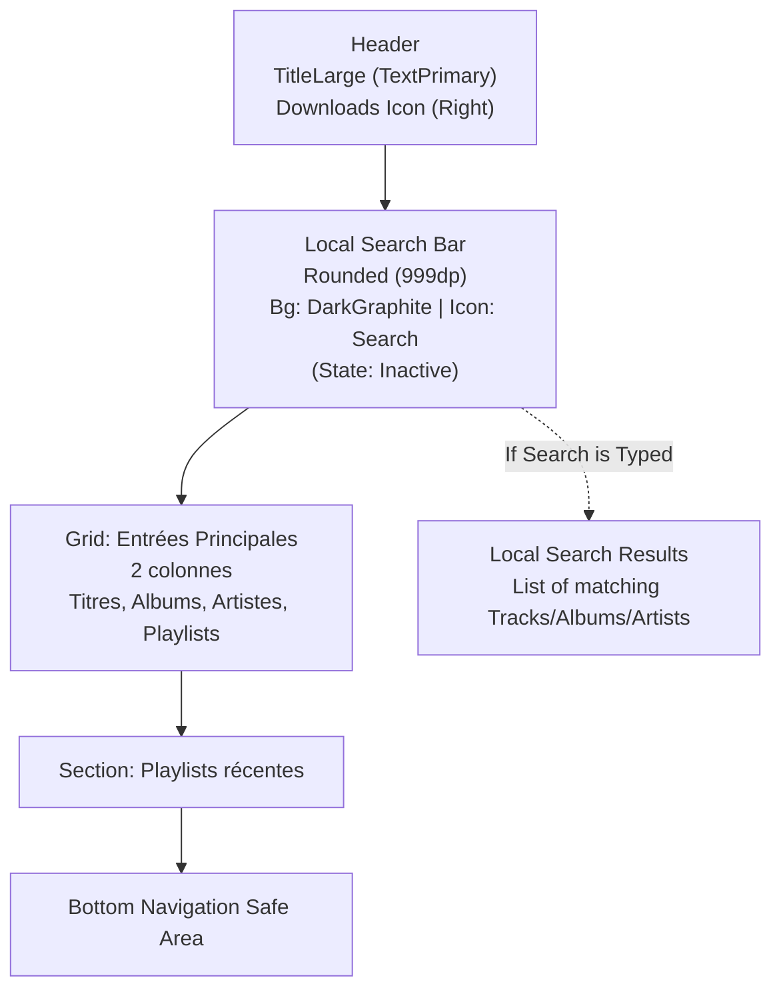

# Library Screen Layout

## Objectif
Définir l'architecture visuelle de l'écran Bibliothèque (`Library`), en s'assurant du respect strict des tokens DA (DarkTheme, typography Outfit, formes arrondies).

## Schéma Vertical



## Coupe Mobile Approximative (État par défaut)

```text
+--------------------------------------------------+
| Bibliothèque                   [Téléchargements] |
|                                                  |
| ( ) Rechercher dans vos musiques locales...      |
|                                                  |
| +--------------------+  +--------------------+   |
| | (Icon: Music)      |  | (Icon: Album)      |   |
| | Titres             |  | Albums             |   |
| | 425 éléments       |  | 42 éléments        |   |
| +--------------------+  +--------------------+   |
|                                                  |
| +--------------------+  +--------------------+   |
| | (Icon: Mic)        |  | (Icon: Queue)      |   |
| | Artistes           |  | Playlists          |   |
| | 120 éléments       |  | 5 éléments         |   |
| +--------------------+  +--------------------+   |
|                                                  |
| Playlists récentes                               |
| +--------------+ +--------------+                |
| | Chill Nuit   | | Electro Mix  |                |
| | Playlist     | | Playlist     |                |
| | [Cover]      | | [Cover]      |                |
| +--------------+ +--------------+                |
|                                                  |
|               [Mini-Player Floating]             |
|                                                  |
+--------------------------------------------------+
|   Home   |   Search   | (o) Library | Settings   |
+--------------------------------------------------+
```

## Coupe Mobile Approximative (État de Recherche)

```text
+--------------------------------------------------+
| Bibliothèque                   [Téléchargements] |
|                                                  |
| (x) Muse|                                        |
|                                                  |
| Artistes correspondants                          |
| +----------------------------------------------+ |
| | (Icon: Mic) Muse                 >           | |
| +----------------------------------------------+ |
|                                                  |
| Titres correspondants                            |
| [Cover] Hysteria - Muse                          |
| [Cover] Plug In Baby - Muse                      |
| [Cover] Time Is Running Out - Muse               |
|                                                  |
| Albums correspondants                            |
| +--------------+ +--------------+                |
| | Absolution   | | Origin of... |                |
| | Muse         | | Muse         |                |
| +--------------+ +--------------+                |
|                                                  |
|                                                  |
|               [Mini-Player Floating]             |
|                                                  |
+--------------------------------------------------+
|   Home   |   Search   | (o) Library | Settings   |
+--------------------------------------------------+
```

## Jetpack Compose Mapping (Tokens)
- **Background Général** : `DeepBlack`
- **Search Bar** :
    - Arrondi maximal : `999.dp` (Pill shape)
    - Fond : `ElevatedGraphite`
    - Texte interne : `BodyLarge` (`TextSecondary`)
- **Main Entries (Cards)** :
    - Grille (`LazyVerticalGrid` à 2 colonnes) ou deux `Row` équilibrées.
    - Arrondi : `20.dp`
    - Fond : `DarkGraphite` (avec léger hover en `ElevatedGraphite`)
    - Icône d'accentuation : `BlazeOrange` ou couleur dépendante de l'entrée.
    - Titre : `TitleMedium` (`TextPrimary`)
    - Sous-titre : `BodyMedium` (`TextSecondary`)
- **Search Results** :
    - Fait disparaître la grille et les playlists.
    - Headers de section : `TitleMedium` (`TextPrimary`).
    - Lignes de titres (`TrackRow`) identiques à l'accueil.
- **Espacements** :
    - Marges externes (`Padding` horizontal) : `16.dp`
    - Espacement entre les tuiles de la grille : `12.dp`
    - Espace top-header : `32.dp`
