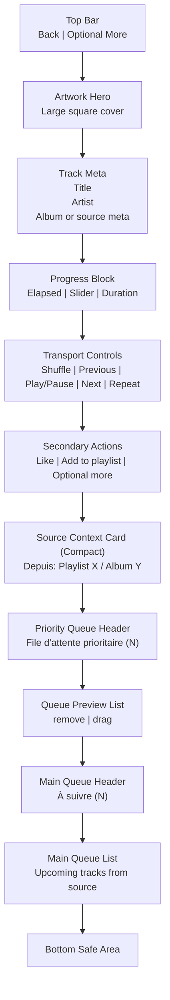

# Player Screen Layout

## Objectif
Visualiser une proposition de composition du `Player` afin de verifier que toutes les informations critiques tiennent sur un ecran mobile sans surcharger l'interface.

## Hypothese de layout
- la zone haute est reservee a l'identite de la piste
- la zone centrale porte les controles critiques
- la zone basse affiche le contexte source et une `priority queue` compacte
- la `priority queue` est visible en apercu sur l'ecran principal, puis extensible par scroll dans la partie basse

## Schema vertical



## Coupe mobile approximative

```text
+--------------------------------------------------+
| Back                                  Optional   |
|                                                  |
|                [ Large Artwork ]                 |
|                                                  |
|               Track Title                        |
|               Artist Name                        |
|               Album or Context                   |
|                                                  |
|  01:12      ----------------------      03:45    |
|                                                  |
| Shuffle   Prev      Play/Pause     Next  Repeat  |
|                                                  |
|        Like        Add to playlist      ...      |
|                                                  |
| [ Depuis: Playlist Chill Nuit                  ] |
|                                                  |
|  File d'attente prioritaire (3)                  |
|  [#1] Song A                     remove     drag |
|  [#2] Song B                     remove     drag |
|  [#3] Song C                     remove     drag |
|                                                  |
|  À suivre (45)                                   |
|  [Note] Song D                                   |
|  [Note] Song E                                   |
|                                                  |
+--------------------------------------------------+
```

## Regle de densite
- l'ecran principal ne doit montrer que 1 a 3 lignes de queue simultanement
- si la queue depasse cette taille, le reste se parcourt par scroll vertical dans la partie basse
- la cover reste prioritaire visuellement sur les grands telephones
- sur petits ecrans, la cover peut etre reduite avant de compresser la zone controles

## Variante compacte recommandee
- si la hauteur disponible est trop faible, reduire la taille de la cover
- conserver toujours visibles :
  - titre de piste
  - slider
  - `Previous`
  - `Play/Pause`
  - `Next`
  - carte de contexte source
  - au moins un apercu de la queue

## Point de vigilance
- si la queue devient trop longue, il faudra choisir entre :
  - un scroll integre dans la partie basse
  - une bottom sheet de queue plus detaillee
- pour v1, la solution la plus simple reste une partie basse scrollable limitee a la queue
