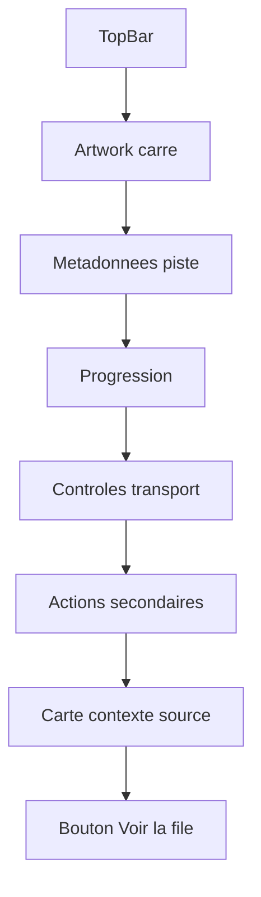

# Player Screen Layout

## Objectif
Definir le layout canonique du lecteur plein ecran. Le player separe maintenant la vue de lecture et la vue de file d'attente afin de garder les controles critiques lisibles tout en permettant une queue longue, scrollable et reorderable.

## Structure racine
- `Scaffold` plein ecran avec fond `MaterialTheme.colorScheme.background`
- TopBar horizontale composee de :
  - bouton de fermeture `KeyboardArrowDown`
  - controle segmente `Lecteur` / `File`
  - menu `MoreVert`
- etat vide centre : `Aucune lecture active`
- dialogue `SelectPlaylistDialog` quand l'utilisateur ajoute la piste courante a une playlist

## TopBar
- Le bouton retour ferme le lecteur.
- Le controle segmente est la navigation interne principale :
  - `Lecteur` affiche artwork, metadata, progression, controles et contexte.
  - `File` affiche les queues en pleine hauteur.
- Le menu contextuel expose :
  - ajouter ou retirer des favoris
  - ajouter a une playlist
  - voir l'artiste si `artistId` est disponible
  - voir l'album si `albumId` est disponible

## Vue `Lecteur`

### Ordre vertical

```mermaid
flowchart TD
    A["TopBar"] --> B["Artwork carre"]
    B --> C["Metadonnees piste"]
    C --> D["Progression"]
    D --> E["Controles transport"]
    E --> F["Actions secondaires"]
    F --> G["Carte contexte source"]
    G --> H["Bouton Voir la file"]
```

### Artwork
- image carree, `fillMaxWidth`, padding horizontal 32.dp
- ratio 1:1 et coins 16.dp
- `AsyncImage` si `coverUri` existe
- placeholder `MusicNote` sur degrade graphite si aucune cover n'est disponible

### Metadonnees
- titre centre, `headlineMedium`, gras, une ligne maximum
- artiste en `titleMedium`, une ligne maximum
- album en `bodyMedium` si `albumTitle` est non vide

### Progression
- `Slider` interactif
- temps courant a gauche, duree totale a droite
- l'etat de draft de seek est local au composant pour eviter les sauts pendant le drag

### Controles transport
- ordre stable : `Shuffle`, `Previous`, `Play/Pause`, `Next`, `Repeat`
- `Play/Pause` est le bouton principal, cercle 72.dp
- `Shuffle` et `Repeat` utilisent la couleur primaire quand ils sont actifs

### Actions secondaires
- bouton favori avec etat visuel rempli/non rempli
- bouton `PlaylistAdd`
- les actions plus rares restent dans le menu de TopBar

### Contexte source
- `SourceContextCard` visible sauf pour `recent_tracks`
- libelle : `Depuis : ...`
- mappings actuels :
  - `playlist` -> `Une playlist locale`
  - `album` -> `Un album`
  - `artist` -> `Un artiste`
  - `search_results` -> `Les resultats de recherche`
  - `recent_tracks` -> `Les pistes recentes`
  - fallback -> `Lecture directe`

### Acces queue
- bouton bas de page : `Voir la file d'attente (N titres)`
- `N` additionne priority queue et main queue
- ce bouton bascule vers la vue `File`

## Vue `File`

### Comportement general
- `LazyColumn` pleine hauteur
- support du drag and drop via `rememberReorderableLazyListState`
- separation stricte entre priority queue et main queue
- `contentType` dedies pour headers, priority items, main items et footer

### Priority queue
- header : `File d'attente prioritaire (N)`
- etat vide : `Aucune piste ajoutee manuellement.`
- lignes reorderable avec cle stable `pq_${internalId}`
- suppression par bouton `Close`
- drag handle visible sur chaque ligne

### Main queue
- header : `A suivre (N)` uniquement si la queue source est non vide
- lignes reorderable avec cle stable `mq_${internalId}`
- suppression par bouton `Close`
- drag handle visible sur chaque ligne
- la liste visible est limitee aux 30 prochaines pistes pour proteger les performances
- footer `Et X autres pistes...` si la main queue depasse 30 elements

## Lignes de queue
- cover 40.dp si `coverUri` existe
- placeholder `MusicNote` sinon
- titre une ligne
- artiste une ligne
- elevation animee pendant le drag
- fond `surfaceVariant` pendant le drag, transparent sinon

## Regles de performance
- la progression rapide est isolee dans `PlaybackProgressBlock`
- les queues visibles sont derivees via `derivedStateOf`
- les lambdas de suppression sont memorisees
- les cles de `LazyColumn` doivent rester stables et basees sur `internalId`
- les deux familles de queue ne doivent jamais accepter un drag croise

## Etats
- `empty` : aucune piste courante
- `playing`
- `paused`
- `buffering`
- `error`
- `queue_empty`
- `queue_reorder_active`

## Regles fonctionnelles
- `Next` privilegie toujours la priority queue.
- `Previous` suit la logique de redemarrage puis historique reel.
- Reordonner la main queue ne change pas le contexte source.
- Reordonner la priority queue ne modifie que l'ordre des pistes ajoutees manuellement.
