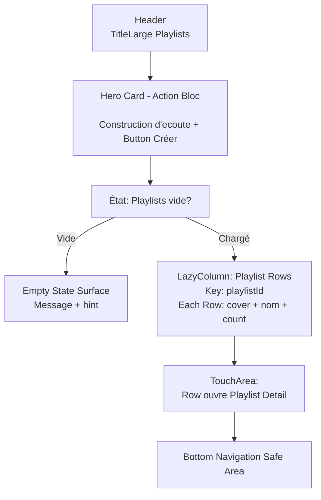
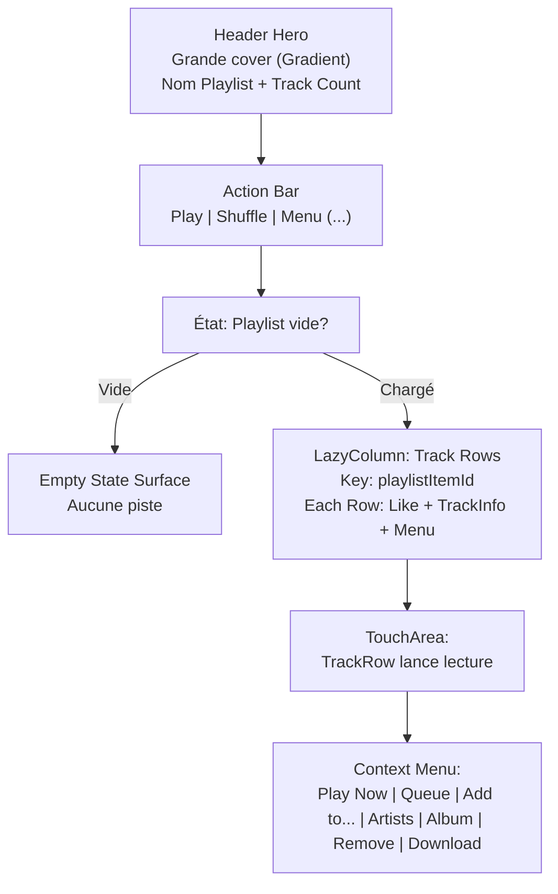

# Playlists Screen Layout

## Objectif
Définir l'architecture visuelle de l'écran Playlists (`PlaylistsScreen`) et sa détail (`PlaylistDetailScreen`), en s'assurant du respect strict des tokens DA (DarkTheme, typography Outfit, formes arrondies) et de la cohérence avec Library Layout.

## PlaylistsScreen - Schéma Vertical



## PlaylistDetailScreen - Schéma Vertical



## PlaylistsScreen State - Coupe Mobile (État par défaut)

```text
+--------------------------------------------------+
| [Retour Flèche]         Playlists                |
|                                                  |
| +--------------------+                           |
| | Construis tes      |                           |
| | contextes d'ecoute |                           |
| |                    |                           |
| | Les playlists ...  |                           |
| |     [+ Créer]      |                           |
| +--------------------+                           |
|                                                  |
| +----------------------------------------------+ |
| | [Cover] Chill Nuit              6 pistes   >  | |
| +----------------------------------------------+ |
|                                                  |
| +----------------------------------------------+ |
| | [Cover] Electro Mix             12 pistes  >  | |
| +----------------------------------------------+ |
|                                                  |
| +----------------------------------------------+ |
| | [Cover] Focus Work              4 pistes   >  | |
| +----------------------------------------------+ |
|                                                  |
| +----------------------------------------------+ |
| | [Cover] Road Trip               25 pistes  >  | |
| +----------------------------------------------+ |
|                                                  |
|               [Mini-Player Floating]             |
|                                                  |
+--------------------------------------------------+
|   Home   |   Search   | (o) Library | Settings   |
+--------------------------------------------------+
```

## PlaylistsScreen State - Coupe Mobile (État vide)

```text
+--------------------------------------------------+
| [Retour Flèche]         Playlists                |
|                                                  |
| +--------------------+                           |
| | Construis tes      |                           |
| | contextes d'ecoute |                           |
| |                    |                           |
| | Les playlists ...  |                           |
| |     [+ Créer]      |                           |
| +--------------------+                           |
|                                                  |
|                                                  |
| Pas encore de playlist                           |
|                                                  |
| Les playlists locales pilotent la lecture       |
| et bientot la sync cloud.                        |
|                                                  |
| Crée ta première pour commencer.                |
|                                                  |
|                                                  |
|               [Mini-Player Floating]             |
|                                                  |
+--------------------------------------------------+
|   Home   |   Search   | (o) Library | Settings   |
+--------------------------------------------------+
```

## PlaylistDetailScreen - Coupe Mobile (État par défaut)

```text
+--------------------------------------------------+
| [Retour Flèche]         Chill Nuit (6 pistes)   |
|                                                  |
| +----------+                                     |
| |          |                                     |
| | [Gradient|  Cover Hero (1:1 ratio)            |
| |  Cover]  |  Chill Nuit                        |
| |          |  6 pistes • Mis à jour aujourd'hui|
| +----------+                                     |
|                                                  |
| +---------+-----------+---------+                |
| | [Play]  | [Shuffle] | [...  ] |                |
| +---------+-----------+---------+                |
|              Menu (...)                          |
|              • Renommer                          |
|              • Supprimer                         |
|                                                  |
| [Cover] Titre Track 1 - Artist           [Menu]  |
| [Cover] Titre Track 2 - Artist           [Menu]  |
| [Cover] Titre Track 3 - Artist           [Menu]  |
| [Cover] Titre Track 4 - Artist           [Menu]  |
| [Cover] Titre Track 5 - Artist           [Menu]  |
| [Cover] Titre Track 6 - Artist           [Menu]  |
|                                                  |
|               [Mini-Player Floating]             |
|                                                  |
+--------------------------------------------------+
|   Home   |   Search   | (o) Library | Settings   |
+--------------------------------------------------+
```

## PlaylistDetailScreen - Coupe Mobile (État vide)

```text
+--------------------------------------------------+
| [Retour Flèche]         Ma Playlist (0 pistes)  |
|                                                  |
| +----------+                                     |
| |          |                                     |
| | [Gradient|  Cover Hero                        |
| |  Cover]  |  Ma Playlist                       |
| |          |  0 pistes                          |
| +----------+                                     |
|                                                  |
| +---------+-----------+---------+                |
| | [Play]  | [Shuffle] | [...  ] |                |
| |(locked) | (locked)  |         |                |
| +---------+-----------+---------+                |
|              Menu (...)                          |
|              • Renommer                          |
|              • Supprimer                         |
|                                                  |
| Aucune piste pour l'instant                      |
|                                                  |
| Accede a Recherche ou Bibliotheque              |
| pour ajouter des pistes a cette playlist.        |
|                                                  |
|               [Mini-Player Floating]             |
|                                                  |
+--------------------------------------------------+
|   Home   |   Search   | (o) Library | Settings   |
+--------------------------------------------------+
```

## Jetpack Compose Mapping (Tokens)

### PlaylistsScreen

**Background Général** : `DeepBlack`

**Hero Card (Action Bloc)**
- Forme : `RoundedCornerShape(28.dp)`
- Fond : `DarkGraphite` (légère élévation)
- Padding interne : `20.dp vertical + 20.dp horizontal`
- Titre (`Text`) : `TitleLarge` (`TextPrimary`, `FontWeight.Bold`)
- Descriptif (`Text`) : `BodyMedium` (`TextSecondary`)
- Button (`Button`) : 
  - Label : "Créer une playlist"
  - Icon : `Icons.Rounded.Add`
  - Style primaire (accent `BlazeOrange`)

**Playlist Rows (LazyColumn)**
- Espacements verticaux entre rangées : `12.dp`
- Padding horizontal : `16.dp`
- Chaque rangée :
  - Forme : `RoundedCornerShape(16.dp)`
  - Fond : `DarkGraphite` 
  - Padding : `12.dp`
  - Layout : `Row(horizontalArrangement = Arrangement.SpaceBetween)`
    - Gauche : Cover placeholder `(64.dp x 64.dp)` + Column(nom + count)
    - Droite : Icon `>` (indicateur navigation)
  - État pressé : fond passe à `ElevatedGraphite`
  - Cursor: pointeur de navigation
  
**Empty State**
- Message primaire : `TitleMedium` (`TextPrimary`)
- Message secondaire : `BodyMedium` (`TextSecondary`)
- Centré vertical avec padding `32.dp`

---

### PlaylistDetailScreen

**Background Général** : `DeepBlack`

**Header Hero**
- Cover box : `Modifier.fillMaxWidth().aspectRatio(1f)`
- Gradient : palette de couleurs (eg. `BlazeOrange` + `DeepBlack`)
- Arrondi : `RoundedCornerShape(24.dp)` (bas uniquement, si design)
- Padding autour : `16.dp`
- Texte superposé (optionnel) : `TitleLarge` (`TextPrimary`) + `BodyMedium` (`TextSecondary`)

**Metadata Row (après header)**
- Nom Playlist : `HeadlineMedium` (`TextPrimary`, `FontWeight.Bold`)
- Count + Date : `BodyMedium` (`TextSecondary`)
- Padding : `16.dp horizontal`Menu)**
- Layout : `Row(horizontalArrangement = Arrangement.SpaceEvenly)`
- Padding : `16.dp`
- Buttons Play & Shuffle :
  - Forme : `RoundedCornerShape(12.dp)`
  - Fond : `ElevatedGraphite` (normal) ou `DarkGraphite` (locked)
  - Icon + Label stacked (optionnel) ou icon seul
  - Tint : `BlazeOrange` (active) ou `TextSecondary` (locked)
  - État locked si playlist vide (Play + Shuffle)
- Menu button (...) :
  - Icon : `Icons.Outlined.MoreVert` ou `Icons.Outlined.MoreHoriz`
  - Ouvre `DropdownMenu` avec items : "Renommer", "Supprimer"
  - Toujours actif (jamais lockedraphite` (locked)
  - Icon + Label stacked (optionnel) ou icon seul
  - Tint : `BlazeOrange` (active) ou `TextSecondary` (locked)
  - État locked si playlist vide (Play + Shuffle)

**Track Rows (LazyColumn)**
- Identique à `TrackRow` standard (HomeScreen / SearchScreen)
- Spacing : `8.dp` entre les rows
- Padding horizontal : `16.dp`
- Key : `playlistItemId` (stable)
- TouchArea : navigation vers lecture + contexte playlist

---

## Dialogues

### Create / Rename Playlist Dialog
- Title : "Créer une playlist" ou "Renommer"
- TextField : `OutlinedTextField` avec hint = "Nom de la playlist"
- Buttons : `Annuler` | `Confirmer`
- Validation : non-vide, max 120 caractères

### Delete Confirmation Dialog
- Title : "Supprimer cette playlist ?"
- Body : "Cette action est irréversible."
- Buttons : `Annuler` | `Supprimer` (couleur error si possible)

### Track Context Menu (Long-press ou icon Menu)
- Items :
  1. Lire maintenant
  2. Ajouter à la file d'attente
  3. Ajouter à une autre playlist
  4. Voir l'artiste
  5. Voir l'album
  6. Retirer de cette playlist
  7. Télécharger / Supprimer le téléchargement

---

## Règles et Contraintes

1. **Stabilité des Keys** : `playlistId` pour chaque Playlist Row, `playlistItemId` pour TrackRow.
2. **Pas de scrolling horizontal** : tout est vertical (LazyColumn).
3. **Mini-Player** : toujours visible si une piste joue, même en détail.
4. **Navigation** : back button depuis PlaylistDetail ramène à PlaylistsScreen via `onNavigateBack()`.
5. **Rafraîchissement** : après create/rename/delete, incrémenter `refreshTick` pour notifier les `produceState`.
6. **Empty States** : affichés avec `EmptyStateSurface` centrée, même bouton "Créer" reste visible.
