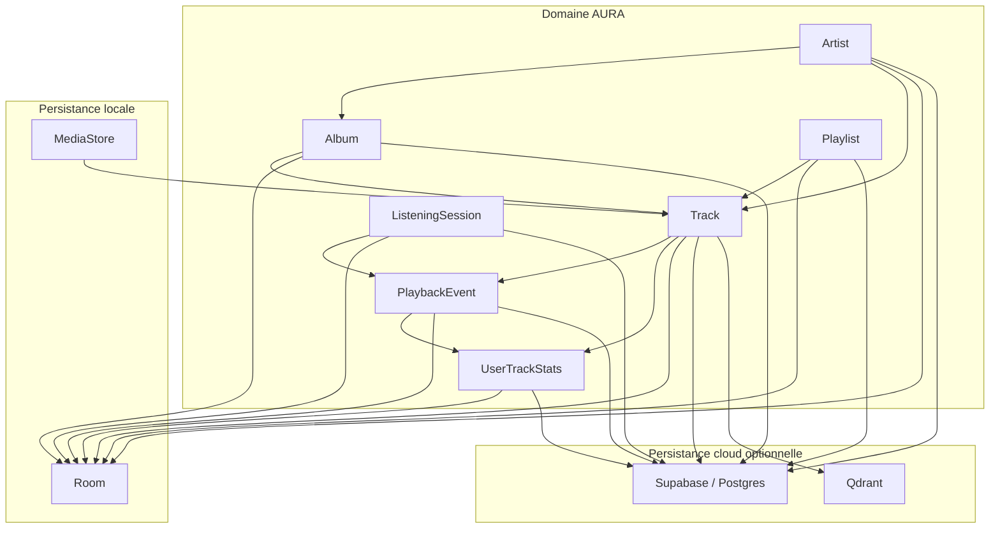

# Domain Data Relationships

## Objectif
Donner une vue d'ensemble des entites metier AURA et de leur repartition entre `MediaStore`, `Room`, `Postgres` et `Qdrant`.

## Principes de lecture
- Le domaine AURA est defini par des entites metier stables, puis projete vers plusieurs systemes de persistance.
- `Room` porte l'etat applicatif local durable.
- `Postgres` porte l'etat cloud synchronisable quand la sync est active.
- `MediaStore` decrit les fichiers locaux reels presents sur le telephone.
- `Qdrant` stocke des vecteurs et un payload de metadonnees, mais n'est jamais une base transactionnelle.

## Cardinalites importantes
- Un `Track` reference zero ou un `Album` principal et zero ou un `Artist` principal.
- Un `Playlist` contient plusieurs items ordonnes et une meme piste peut apparaitre plusieurs fois dans une meme playlist.
- Une `ListeningSession` emet plusieurs `PlaybackEvent` et peut alimenter plusieurs lignes d'historique.
- Un `UserTrackStats` agrege une piste pour une periode donnee, pas une session unique.
- Une piste AURA peut exister sans fichier local, sans mapping provider ou sans presence cloud.

## Frontieres de persistance
- `MediaStore` ne porte ni playlists, ni likes, ni historique, ni snapshot de lecture.
- `Room` est la source de verite locale pour playlists, likes, snapshots, historique, stats et mappings provider.
- `Postgres` ne replique pas `MediaStore`, la navigation UI, le scroll ni la `priority queue`.
- `Qdrant` conserve un vecteur par piste documentee ainsi qu'un payload de metadonnees, dont l'identifiant AURA de piste.

## Donnees explicitement non persistees comme donnees metier
- la `priority queue` du player
- la pile d'ecrans de navigation
- le niveau de scroll d'un ecran
