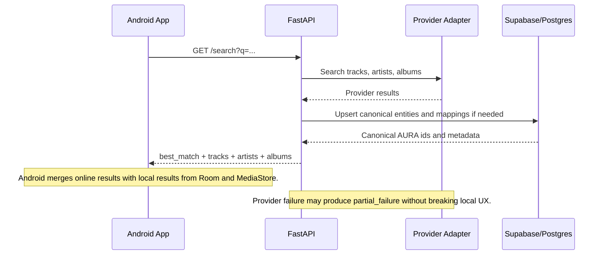
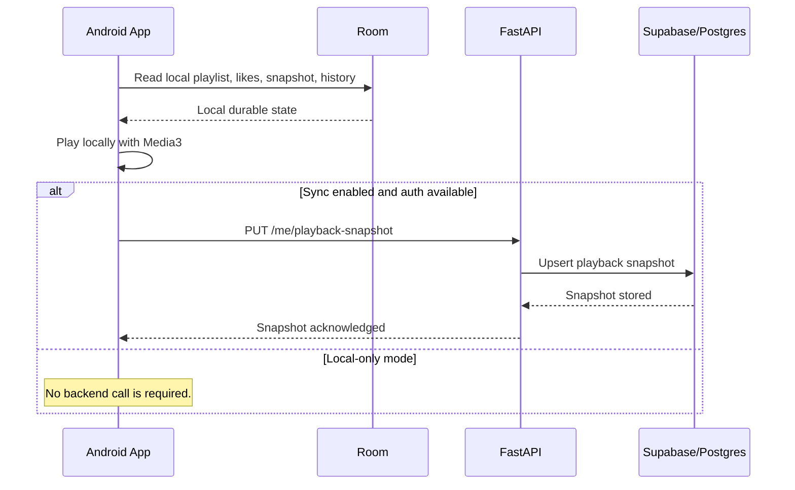
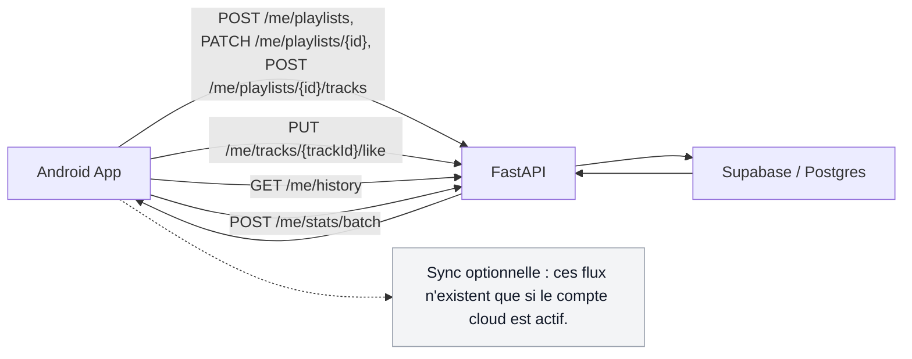
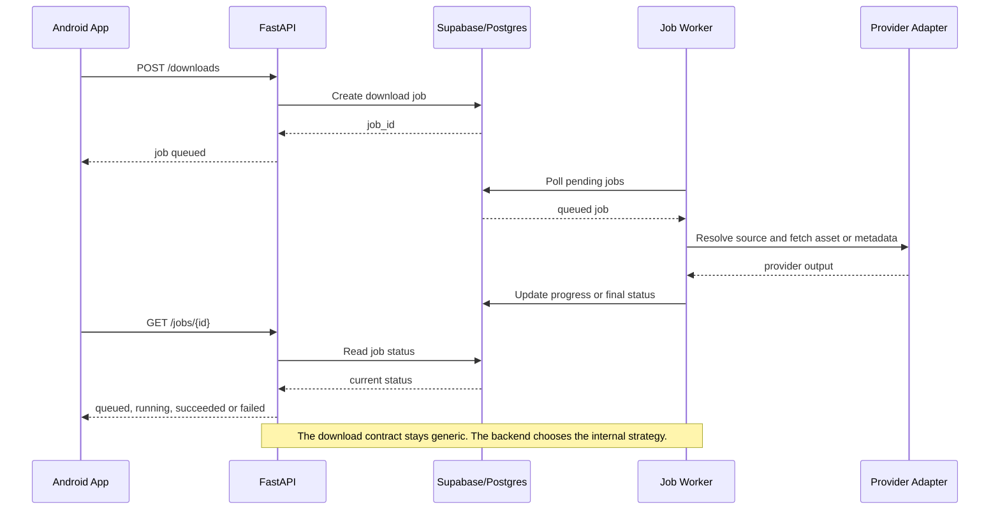
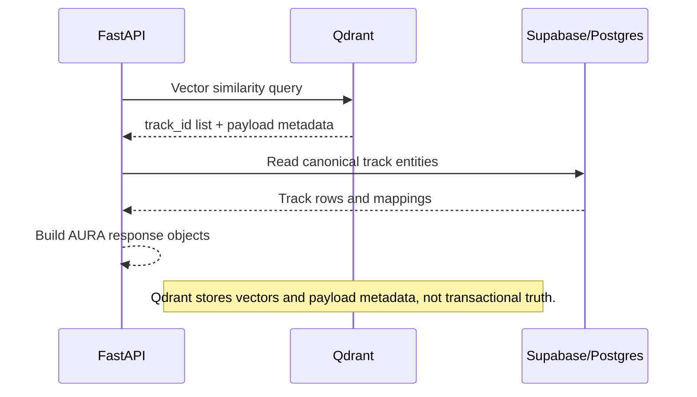

# API Sync Flows

## Objectif
Donner une vue des principaux flux entre l'application Android, l'API FastAPI, `Supabase / Postgres`, `Qdrant` et les workers de jobs.

## Principes de lecture
- Les flux ci-dessous decrivent uniquement les echanges online et sync.
- Le mode local-first continue d'exister sans ces flux.
- La fusion entre resultats locaux et online reste toujours cote Android.

## Flux 1 - Recherche online enrichie

## Flux 2 - Lecture locale avec sync cloud optionnelle

## Flux 3 - Sync des playlists, likes et historique

## Flux 4 - Telechargement et job asynchrone

## Flux 5 - Recommandation et recherche vectorielle

## Limites explicites
- Aucun flux n'encode la `priority queue`, car elle n'est pas persistee.
- Aucun flux n'encode la navigation UI ou le niveau de scroll.
- Le choix interne exact de source de telechargement reste volontairement opaque a ce stade.
