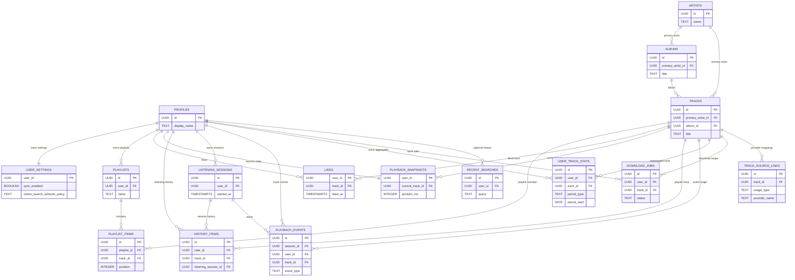

# Postgres Relationships

## Objectif
Donner une vue relationnelle des tables synchronisables cote `Supabase / Postgres`.

## Principes de lecture
- Ce diagramme couvre les donnees cloud durables exposees ou manipulees par le backend.
- Le cloud ne replique pas `MediaStore`, la navigation UI, le scroll ni la `priority queue`.
- Les donnees restent optionnelles a l'echelle produit : elles ne sont utiles que si la sync ou le compte cloud est actif.

## Cardinalites importantes
- `profiles` est la racine des donnees utilisateur synchronisables.
- `user_settings` et `playback_snapshots` sont en relation 1:1 avec un profil.
- `likes` est une table de jointure utilisateur <-> piste.
- `user_track_stats` agrege une piste par utilisateur et par periode.
- `recent_searches` reste optionnelle et bornee a une fenetre glissante.

## Donnees explicitement absentes du cloud
- aucune replication brute de `MediaStore`
- aucune `priority queue`
- aucune pile de navigation
- aucun niveau de scroll
